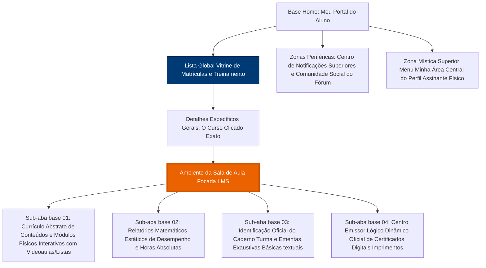

# 5. Arquitetura da Informação e Fluxos de Usuário (User Flows)

À medida que o LMS avança para dominar complexos cursos com centenas de ramificações, ele corre graves perigos de transfigurar-se num labirinto cognitivo hostil. O coração central do arquiteto da plataforma visa proteger a "Jornada Ideal" através da estipulação e salvaguarda perpétua da inquebrantável regra mágica dos poucos e polidos cliques.

Para as equipes entenderem o corpo esquelético de transições de telas (os diagramas e Sitemap base):

---

## 🗺️ Mapa de Navegação em Superfície Fria (Sitemap Principal)

Esta é a estrutura base da matriz da planta baixa do sistema visualizado a partir da visão superior que desce por ramificações lógicas lineares sem encruzilhadas ou repetições. A âncora inicial unificada reside na "Home", se derivando paras esconsas restritas de base operacional dos Cursos ("Sala de Aula Clássica").

*(Nota: O bloco Laranja no diagrama denota precisamente qual Universo Espacial nossa interface UI Kit centralizada mapeada recém-criada atua neste momento de maturidade global em desenvolvimento).*

---

## 🏃 Fluxos de Ouro Matriciais (User Flows - The Ideal Golden Path)
Como e de que jeito garantimos travessia do oceano sem perda da direção aos calouros desinformados desprovados e cegos do LMS inicial recém atracado online via senhas cruas primárias iniciais da base sistêmica principal da hospedagem final até pegar em mãos sua medalha virtual certificadora?

### Fluxo Essencial Rumo Ao Acerto 100% de Aprovação:
Uma jornada estudantil ideal do Calouro ao Graduado que deve estar selada em banco usando interações reduzidas com fricção desobstruída nos túneis de cliques da interface gráfica global em transição das bases até a conclusão sem volta em círculos labirínticos exaustivos de base:
1.  **Etapa Base de Atracação Aérea (Login no Sistema Externo):** Input cru de banco central de senhas abstratas no motor lógico do autenticador sistêmico e aterrissagem veloz sem ruídos ao chão unificado central ("O Hub ou Dashboard Pai principal de tudo").
2.  **Varredura Tática Instintiva Primária Curta (Home Cursos):** Varre com a barreira ocular sua aba esqueda de resumos ou sua grade matriz até desenterrar na sujeira imagética da plataforma abstrata a capa visual panorâmica central gigante instintiva Laranja focada com o rotulo do projeto do destino esperado ou clique da pesquisa focada digitada em lupa do header centralizado escavador (Encontrando e perfurando de imediato o alvo "Curso Sobre Aquele Movidesk X").
3.  **Engate Veloz ao Progresso Pausado Constatado (Onde Parei):** Ao atracar a face inicial com ambiente global mestre de *Aba Currículo (Conteúdo)* descrita no UI kit, varredura passiva procura pela barra vertical gritante Verde exclamando de longe "*(último tópico visitado pulsa exatamente aqui seu animal)*", poupando que varra mentalmente listras opacas sanfonadas em dores crônicas sem sentido rumo ao fim desconhecido abissal ou inicie módulos re-arranjados em lugares errados estorvando progresso estatístico vital atrelando prejuizo cerebral a perda inútil analítica totalitária crônica do dia. 
4.  **Consumação do Currículo Linear Exaurido Vertical Tabular:** Assistência cronológica nas videoaulas (marcando verde absoluto ao final do Play natural sistêmico), provas (marcando check de score), repetição de engate exaurido da esquerda com a aba passiva de Conteúdos até que o indicador gordo percentual atrelado a Barra à Esquerda esgote graficamente de vermelho reprovado pra exaurido vitorioso preenchendo o anel aos plenos "100.00%". 
5.  **Exfiltração Rumo Ouro Imprintado Reivindicativo:** Cliques com zero perdas colaterais na aba derradeira superior Laranja reluzente focada a frente "Aba Certificados Virtuais". Engole o modelo cego visualizando ícone prateado desarmar bloqueios rígidos em base e exibe estardalhaço modal botão impresso focado para "Exportar Conquista". Fim do Macro ciclo limpo do fluxo.
